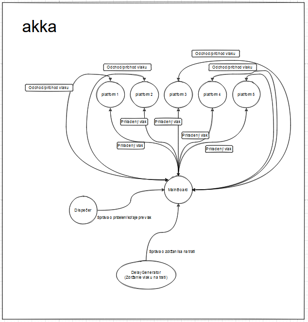

# III. Akka aktor

### Implementujte zadanie, ktoré podporuje len nasledovné vlastnosti:

   - evidencia príchodu. Prijmite správu, ktorá hovorí, ktorý vlak, v ktorý dátum a čas dorazil na konkrétne nástupište.
   - evidencia odchodu. Prijmite správu, ktorá hovorí, ktorý vlak, v ktorý dátum a čas odišiel z konkrétneho nástupišta
   - evidencia meškania. Umožnite sledovať meškania vlakov
   - výpis najbližších 20 odchádzajúcich vlakov krížom cez všetky nástupištia pre účely centrálnej elektronickej tabule

Pri demonštrácii predpokladajte, že na stanici existuje 5 elektronických tabúľ, ktoré nezávisle od seba ukazujú informácie. Tabule sa môžu kaziť – preukážte to v kóde.

Použite jedného hlavného aktora, ktorý bude prijímať príkazy zodpovedajúce jednotlivým službám a výsledky bude vracať do mimoaktorového sveta primeraným spôsobom.